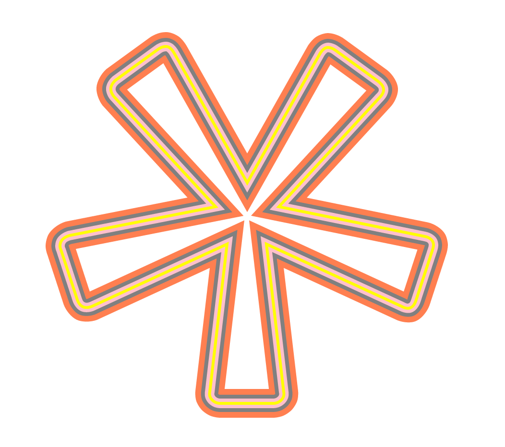

SVGPathInfo
===========

Lightweight Javascript library for parsing and modifying an SVG path.
Use it online <a href='https://danya.ca/SVGPathInfo/'>here</a>.

<h2>How To</h2>
The available methods are <code>getJSON()</code>, <code>getCommands()</code>, <code>getCommandsArray()</code>, <code>getSubPaths(deep)</code>, <code>getRelativePath()</code>, <code>getAbsolutePath()</code> and <code>getGlobalCubicBezier()</code>.

Once you've included the script in your page, here's how you start using them:
<h3>Begin</h3>
First, create a new <code>SVGPathInfo</code> object.
You can pass it a handle to a path element:
<pre>
var path_elem = document.getElementById('mypath');
var info1 = new SVGPathInfo(path_elem);
</pre>
<i>Or</i> you can pass it a path string:
<pre>
var path_string = "M0 0 L0 50L50 50M0 200L200 0";
var info2 = new SVGPathInfo(path_string);
</pre>
Now you have access to a bunch of SVGPathInfo's methods:
<h3>getJSON()</h3>
<pre>
var path_json = info2.getJSON();
</pre>
will output
<pre>
{  
   "0":{  
      "type":"M",
      "string":"M0 0",
      "x":"0",
      "y":"0"
   },
   "1":{  
      "type":"L",
      "string":"L0 50",
      "x":"0",
      "y":"50"
   },
   "2":{  
      "type":"L",
      "string":"L50 50",
      "x":"50",
      "y":"50"
   }
   "3":{  
      "type":"M",
      "string":"M0 200",
      "x":"0",
      "y":"200"
   },
   "4":{  
      "type":"L",
      "string":"L200 0",
      "x":"200",
      "y":"0"
   }
}
</pre>
<h3>getCommands()</h3>
<pre>
var path_commands = info2.getCommands();
</pre>
This will return the object that is described by the above JSON string.
</pre>
<h3>getCommandsArray()</h3>
<pre>
var path_commands_array = info2.getCommandsArray();
</pre>
This returns an array of command <i>strings</i>, rather than an object of command <i>objects</i>:
<pre>
["M0 0", "L0 50", "L50 50", "M0 200", "L200 0"]
</pre>
<h3>getSubPaths(deep)</h3>
<pre>
var subpaths = info2.getSubPaths(true);
//OR
var subpaths = info2.getSubPaths(); //default: false
</pre>
This breaks down the path into subpaths, breaking wherever a moveto (<code>M</code>/<code>m</code>) command occurs. The default value of the argument <code>deep</code> is <code>false</code>. If <code>deep</code> is <code>false</code>, it returns an array of subpath strings:
<pre>
["M0 0L0 50L50 50", "M0 200L200 0"]
</pre>
If <code>deep</code> is <code>true</code>, it returns an array of subpath arrays:
<pre>
[["M0 0", "L0 50", "L50 50"], ["M0 200", "L200 0"]]
</pre>
<h3>getAbsolutePath()</h3>
<pre>
var abs_path = info2.getAbsolutePath();
</pre>
Wherever the lowercase form of a command is used, the coordinates that follow the command are <i>relative</i> - their location is specified relative to location of the pen, and not specified absolutely i.e. relative <i>to the point of origin</i> of the svg element (the top left corner).
This function converts the path to the absolute form and returns a string. (Note: my example path is already absolute.)
<h3>getRelativePath()</h3>
<pre>
var rel_path = info2.getRelativePath();
</pre>
This does the opposite of getAbsolutePath() - all absolute commands are modified so as to be specified in relation to the location of the pen.
<pre>
"m0 0 l0 50 l50 0 m-50 150 l200 -200"
</pre>
<h3>getGlobalCubicBezier()</h3>
<pre>
var gcb_path = info2.getGlobalCubicBezier();
</pre>
This function converts each command to a cubic Bézier and returns a string.
<pre>
"M0 0C0 0 0 50 0 50C0 50 50 50 50 50M0 200C0 200 200 0 200 0"
</pre>
<h3>Notes:</h3>
<h4>Accuracy</h4>
There is approximation involved, as is the nature of dealing with Bézier curves, and of course Javascript does famously imprecise maths. However, the result is quite good:

This image is the result of generating path strings using SVGPathInfo's various functions, and assigning the resultant strings to the "d" attribute of path elements. I made the stroke-width of the paths decrease progressively so that all the paths can be seen at once. Here is the JS:
<pre>
var info = new SVGPathInfo(path1);
document.getElementById('path2').setAttribute("d", info.getRelativePath());
document.getElementById('path3').setAttribute("d", info.getAbsolutePath());
document.getElementById('path4').setAttribute("d", info.getGlobalCubicBezier());
</pre>
where 
<code>path1</code> has the original path (orange with <code>stroke-width='30'</code>),  
<code>path2</code> has the relative path (grey with <code>stroke-width='18'</code>), <code>path3</code> has the absolute path (pink with <code>stroke-width='10'</code>), and  <code>path4</code> has the cubic Bézier path (yellow with <code>stroke-width='3'</code>).  
<h4>Validitity</h4>
This library does not check the path's validity. It will likely throw an error or behave unexpectedly if it is provided with an invalid path.
<h4>To Do</h4>
I have not yet implemented a conversion from the arc command (<code>A</code>,<code>a</code>) to cubic Bézier.
